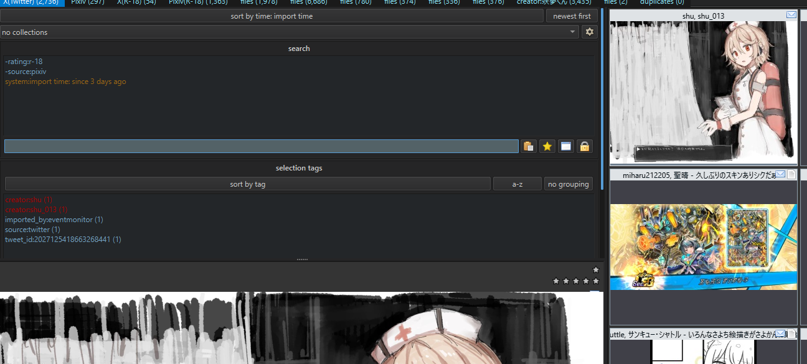

# Hydrus Importer

Twitter/X や Pixiv の画像を [Hydrus Network](https://hydrusnetwork.github.io/hydrus/) にワンクリックでインポートするブラウザ拡張機能です。

画像のダウンロード・インポートに加え、投稿者名・タグ・ソースURL などのメタデータも自動で付与します。

## Features

- **Twitter/X** — タイムライン上の各ツイートに `H` ボタンを追加。クリックするだけで画像をインポート
- **Pixiv** — 作品ページに `H Import` ボタンを表示。複数ページ作品にも対応
- メタデータ自動付与（投稿者名、タグ、ソースURL、R-18 判定など）
- Hydrus Client API への接続テスト機能
- タグサービス・カスタムタグの設定が可能

## Usage

### 1. ツイートを見つける

Twitter/X のタイムラインで、画像付きツイートのアクションバーに `H` ボタンが表示されます。


### 2. インポートする

`H` ボタンをクリックすると、画像のダウンロード・インポート・タグ付けが自動で行われます。


### 3. Hydrus Client で確認

インポートされた画像は、Hydrus Client 上でタグやソースURL と共に確認できます。



## Installation

1. このリポジトリをクローンまたはダウンロード
   ```
   git clone https://github.com/ttttdiva/Hydrus-Importer.git
   ```
2. Edge で `edge://extensions` を開く（Chrome の場合は `chrome://extensions`）
3. 「開発者モード」を有効にする
4. 「展開して読み込み」からクローンしたフォルダを選択

## Setup

1. Hydrus Client で **サービス > client api** からアクセスキーを発行
2. 拡張機能のポップアップを開き、API URL とアクセスキーを入力
3. 「Test Connection」で接続を確認し、「Save」で保存

## Supported Sites

| サイト | 対応ページ | 取得するメタデータ |
|--------|-----------|-------------------|
| Twitter/X | タイムライン全般 | 投稿者名、ツイートID、本文、R-18判定、ソースURL |
| Pixiv | 作品ページ (`/artworks/*`) | 投稿者名、タグ、タイトル、R-18判定、ソースURL |

## License

MIT
